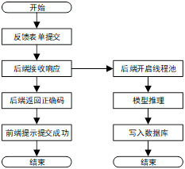

# 基于Bert的简易食堂反馈系统

## 介绍

1.nlp的大作业，实现了一个基于预训练Bert的情感分析以及使用jieba分词生成小黑子词云。

2.前后分离，后端用Flask，前端用的vue，后台模板来自https://github.com/PanJiaChen/vue-admin-template

## 系统展示

1. 词云生成

2. 情感分析

   

## 情感分析模型调用流程

为了加速响应前端请求，后端会开启线程池访问模型。

## 开发环境

1. 后端：Flask
   * pytorch=1.11.0
   * cuda=11.3
2. 前端：VUE （vue-admin-template）

## 安装使用

1. 后端部署：/backend

   * 安装深度学习依赖：pytorch, numpy, scikit-learn, tqdm, tensorboardX
   * 安装后端框架：Flask, Flask-sqlalchemy, pymysql,wordcloud, jieba
   * mysql建一个数据库：bert
   * 将create_table.py, app.py, BertAPI.py中的数据库连接部分修改成自己的数据库内容。
   * 后端文件目录如下图所示：

2. 模型训练:模型基于BERT-CHINESE-BASE模型，请访问以下链接，将模型放入/backend/BertSentiment/bert_pretrain 中：

   https://s3.amazonaws.com/models.huggingface.co/bert/bert-base-chinese.tar.gz

   以及词表下载后修改成vocab.txt放入相同文件夹:

   https://s3.amazonaws.com/models.huggingface.co/bert/bert-base-chinese-vocab.txt

   然后运行/backend/BertSentiment/run.py运行训练代码。训练基于美团外卖数据集实现情感分类，地址在这里：http://www.idatascience.cn/dataset-detail?table_id=429 ；已经预处理完成，数据集在/backend/FoodComment/data文件夹下。模型保存在/backend/FoodComment/saved_dict中。

3. 后端运行：运行/backend/app.py即可

4. 前端部署：/frontend

   * 安装node.js
   * 进入/frontend，npm install
   * 可能需要修改后端的端口，路径在/frontend/vue.config.js中，将http://127.0.0.1:xxx修改成你的Flask后端运行端口。
   * 运行：npm run dev